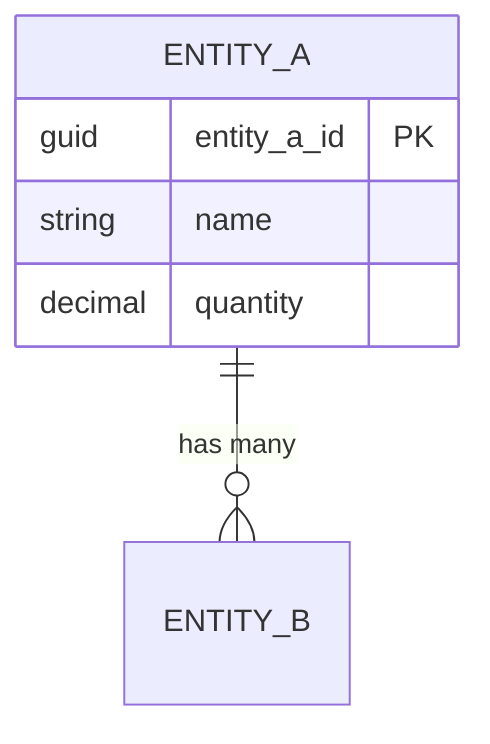

# Solution Architecture Document Section

Generate a new numbered design document following the established conventions of a project's Solution Architecture Document.

## When to Use

- Adding a new domain area to the architecture document
- Documenting a new feature design (e.g., embedded networks, accrual engine, integration interface)
- Updating an existing document section with new decisions

## Inputs to Gather

Ask the user:

1. **Topic** — What domain or feature is this about?
2. **Scope** — What should the document cover? (entity design, data flow, calculations, import logic, etc.)
3. **Audience** — Technical (developer), functional (consultant), or both?
4. **Related docs** — Which existing numbered docs does this connect to?

## Document Numbering

Read `00-document-structure.md` (or the project's equivalent index) to find the next available number. Project doc folders typically use `NN-topic-name.md` with NN as a zero-padded section number.

## Document Template

```markdown
# [Section Number]. [Title]

## Purpose

[1-2 sentences: what this section documents and why it matters]

## Background

[Context the reader needs. Reference other numbered docs where relevant:
"See Section 7 (Activity Data Design) for the base entity model."]

## Design

### [Subsection 1]

[Content with tables, diagrams, and field mappings]

### [Subsection 2]

[More content]

## Entity Model

[If applicable: Mermaid ER diagram]



## Field Mapping

[If applicable: source-to-target mapping table]

| Source | Target | Type | Notes |
|--------|--------|------|-------|
| Location | target_entity_field | Lookup | Match on name |
| ... | ... | ... | ... |

## Calculation Logic

[If applicable: how values are calculated]

## Data Flow

[If applicable: ETL pipeline for this domain]

```
Source → Bronze → Silver → Gold View → Target System → Engine → Output
```

## Configuration Dependencies

[Objects that must exist in the target system before this works]

| Component | Name | Type |
|-----------|------|------|
| Factor Library | "{Client} - ..." | Custom |
| Calculation Model | "{Client} - ..." | Custom |
| Calculation Profile | "{Client} - ..." | Custom |

## Design Decisions

> **Decision [N]**: [Title]
>
> **Context**: [Why this decision was needed]
>
> **Decision**: [What was decided]
>
> **Rationale**: [Why this option was chosen over alternatives]
>
> **Alternatives Considered**: [What else was evaluated]

## Validation Rules

[Business rules and data quality checks]

## Open Items

- [ ] [Outstanding question or TODO]
- [ ] [Another item]

## Appendix

[Reference data, lookup tables, worked examples]
```

## Style Guide

Follow these conventions:

### Formatting
- Use ATX headings (`#`, `##`, `###`)
- Use pipe tables for field mappings and reference data
- Use Mermaid for entity relationship diagrams
- Use code blocks for SQL, Python, JSON examples
- Use blockquotes with bold labels for design decisions

### Language
- Never use em dashes (use " - " instead)
- Never write like AI — humanise it
- Write in present tense for current state, future tense for planned work
- Be specific: name exact entities, fields, values
- Reference other numbered docs by section number

### Content
- Start with Purpose (what and why)
- Include worked examples where calculations or transformations are involved
- Document all configuration dependencies (what must exist for this to work)
- Call out client-specific customisations vs standard product behaviour
- Include expected record counts where applicable

### Tables
- Entity/field reference tables: Entity | Field | Type | Notes
- Mapping tables: Source | Target | Transform | Notes
- Configuration tables: Component | Name | Type | Status

## Quality Checklist

- [ ] Section number doesn't conflict with existing docs
- [ ] Purpose section is clear and concise
- [ ] Design decisions are documented with rationale
- [ ] Entity relationships shown in Mermaid diagram
- [ ] Field mappings are complete (source to target)
- [ ] Configuration dependencies listed
- [ ] References to related numbered docs are correct
- [ ] No em dashes used
- [ ] Worked examples included where applicable
